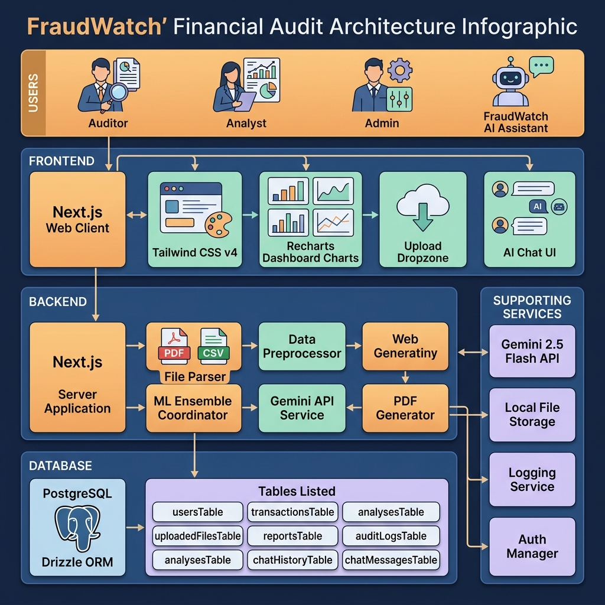
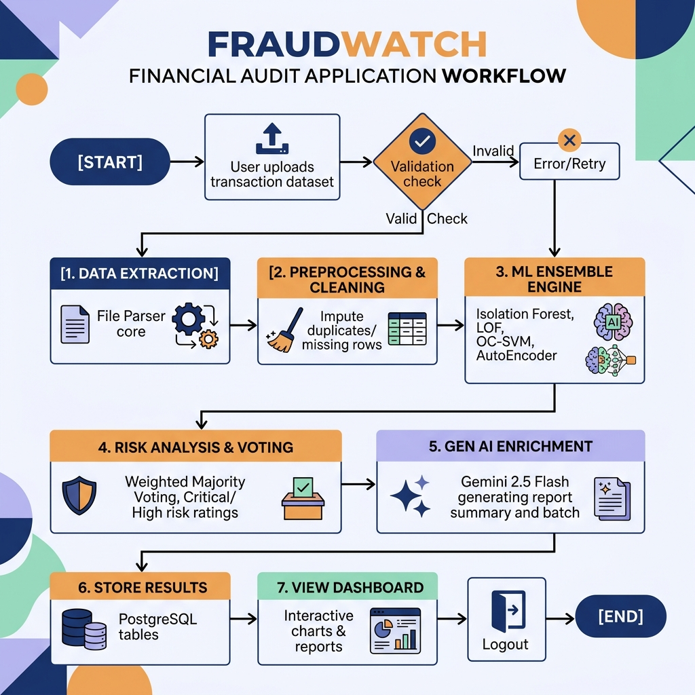

# FRAUDWATCH - SYSTEM DIAGRAMS & TEXT DETAILS

This file contains the complete visual diagrams and textual specifications for the **Workflow Diagram** and the **System Architecture Diagram** for the **FraudWatch** project, structured in the exact same format and style as the reference images.

## Generated Diagram Images

### System Architecture Diagram

### Workflow Diagram

---

## SECTION 1: WORKFLOW DIAGRAM SPECIFICATION

### [START]
* **User Input**: User Uploads Transaction Dataset File
* **Validation Decision**: Valid File Format? (Supports CSV, XLSX, PDF up to 10MB)
  * **No**: Show Invalid File Type/Size Toast Notification -> **HALT**
  * **Yes**: File Accepted -> Proceed to Processing Pipeline

### [1. DATA & TEXT EXTRACTION]
* **Handler**: File Parser Module
* **Operations**:
  * Read raw binary stream from file storage.
  * If CSV: Parse values using line-by-line custom CSV parser.
  * If Excel (XLS/XLSX): Read sheets using workbook utility.
  * If PDF: Extract raw text tables from document pages.
* **Outcome**: Extracted Transaction JSON Array successfully generated.

### [2. DATA PREPROCESSING & CLEANING]
* **Handler**: Preprocessor Module (`dataPreprocessor.ts`)
* **Operations**:
  * Calculate original vs cleaned record count.
  * Identify and remove duplicate transaction rows.
  * Impute missing data points.
  * Filter out corrupted/invalid rows.
  * Compute baseline statistics (Mean Spend Amount, Max Spend, Standard Deviation).

### [3. UNSUPERVISED MACHINE LEARNING MODELS]
* **Handler**: Ensemble Engine (`fraudDetection.ts`)
* **Algorithms**:
  * **Isolation Forest**: Analyzes structural outliers, spend spikes, and location anomalies.
  * **Local Outlier Factor (LOF)**: Measures local density deviation to flag payment type clusters and micro-spend trails.
  * **One-Class SVM**: Establishes boundary envelopes to catch abnormal multi-dimensional vectors.
  * **AutoEncoder (Neural Network)**: Reconstructs transaction features to detect complex behavioral patterns.

### [4. RISK ANALYSIS & ENSEMBLE VOTING]
* **Handler**: Weighted Coordinator
* **Operations**:
  * Apply **Weighted Majority Voting**: 35% IF + 30% AE + 20% LOF + 15% SVM.
  * Calculate Fraud Probability (0.0% - 100.0%).
  * Compute dynamic weighted Risk Score (0 - 100).
  * Assign Risk Level:
    * **Critical Risk** (Score >= 81)
    * **High Risk** (Score 61 - 80)
    * **Medium Risk** (Score 31 - 60)
    * **Low Risk** (Score < 30)

### [5. GEN AI SUMMARIZATION & EXPLANATIONS]
* **Handler**: Gemini 2.5 Flash API Manager (`gemini.ts`)
* **Operations**:
  * **Generate Executive Summary**: Converts ML metrics into threat reports and strategic recommendations.
  * **Generate Batch Transaction Explanations**: Converts ML output vectors of flagged rows into natural-language explanation lists.
  * **Interactive Q&A Assistant**: Provides contextual risk insights during chat conversation.

### [6. STORE RESULTS]
* **Handler**: Drizzle ORM Manager
* **Database Target**: PostgreSQL Database
* **Operations**:
  * Insert bulk transaction records & anomaly metrics.
  * Update main analysis record status from `running` to `completed`.
  * Insert audit log entry containing auditor ID, timestamp, and transaction count.

### [7. VIEW DASHBOARD]
* **Handler**: Client Web UI
* **Insights Displayed**:
  * Fraud Distribution (Recharts Pie) & Risk Breakdown (Recharts Bar).
  * Feature trends (remittance country, merchant targets, payment methods).
  * Detailed transaction listing showing all raw data and dynamic AI explanations.
  * PDF Compliance Report Download.
* **Exit**: User Logs Out -> **[END]**

---

## SECTION 2: SYSTEM ARCHITECTURE DIAGRAM SPECIFICATION

### 1. USERS TIER
* **auditor (User)**: Uploads datasets, runs analysis, reviews dashboards, downloads reports.
* **Analyst**: Examines specific flagged transactions and audit logs.
* **System Admin**: Manages user profiles, databases, and audit logs.
* **FraudWatch AI (AI Assistant)**: Conducts interactive discussions about anomalies.

### 2. FRONTEND (Web Browser Tier)
* **Framework**: React.js (Next.js Client Components) + Tailwind CSS (v4)
* **Client Features**:
  * User Authentication Login / Register Views
  * Dataset Upload Drag & Drop Area
  * Dashboard Insights (Fraud Distribution, Risk Levels, Trend Charts)
  * Detailed Suspicious Transaction List Table
  * Interactive AI Chat Panel
  * Export Tools (Excel, CSV, PDF Report)

### 3. BACKEND (Next.js Server API Tier)
* **Framework**: Next.js Server Components / App Router
* **Server Features & Modules**:
  * Session & Access Authentication Manager
  * File Upload Receiver & Type Validation
  * Parsing Core (CSV reader, XLSX workbook loader, PDF reader)
  * Data Preprocessing & Statistical Imputer
  * Ensemble Classifier Coordinator (Isolation Forest, LOF, SVM, AutoEncoder)
  * Gemini API Service Wrapper (Gemini 2.5 Flash Integration)
  * Report PDF compiler (`pdfkit`)
  * System Logger & Event Auditing Service

### 4. DATABASE TIER
* **ORM Engine**: Drizzle ORM (TypeScript)
* **DBMS**: PostgreSQL Database
* **Database Schema Tables**:
  * `usersTable`
  * `uploadedFilesTable`
  * `analysesTable`
  * `transactionsTable`
  * `reportsTable`
  * `auditLogsTable`
  * `chatHistoryTable`
  * `chatMessagesTable`

### 5. SUPPORTING SERVICES
* **AI Engine (Gemini 2.5 Flash API)**:
  * Generates markdown summary analysis.
  * Explains flagged anomalies in natural language.
  * Powers real-time interactive QA chat.
* **File Storage**:
  * Local Upload Directory: Stores raw CSV, XLSX, and PDF files.
* **Logging System**:
  * Server logs, background processing status, database execution history.
* **Security & Auth**:
  * Clerk / Mock Auth Session bypasses.

---

## SECTION 3: TECHNOLOGY STACK SUMMARY

| Tier | Technology / Library | Role in Project |
| :--- | :--- | :--- |
| **Frontend** | React.js (Next.js Client) | User Interface component layout |
| **Styling** | Tailwind CSS v4 | Harmonious, responsive styles |
| **Visuals** | Recharts | Distribution pies, risk bars, trends |
| **Backend** | Next.js Server / API Routes | API controllers, worker processing pipeline |
| **Database** | PostgreSQL | Persistent SQL database storage |
| **ORM** | Drizzle ORM | Type-safe schema query and mapper |
| **ML Engine** | Custom JavaScript Heuristics | High-performance Isolation Forest, LOF, SVM, AE |
| **AI Integration** | `@google/generative-ai` | Interface client for Google Generative AI |
| **AI Model** | Gemini 2.5 Flash | Large Language Model generating summaries & explanations |
| **Parsing** | `xlsx` / `pdf-parse` | Extracted text and sheets parsing |
| **PDF Reports** | `pdfkit` | Streamable binary PDF report compiler |
